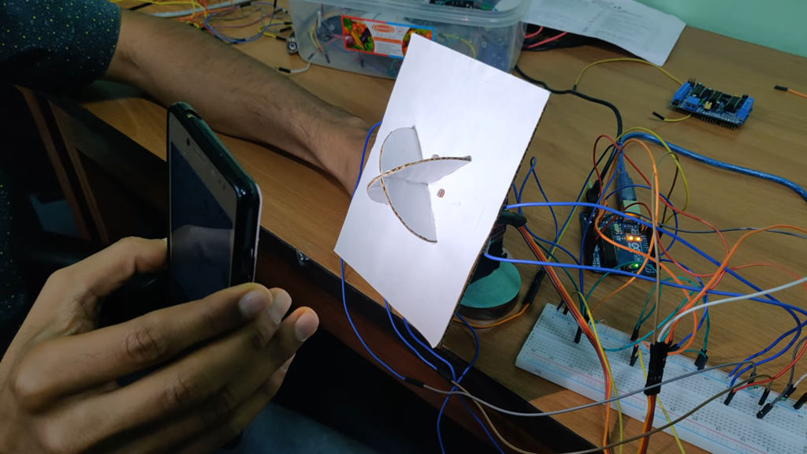

## Simplified Solar Tracker for PV Panels

  
  

    <em>Figure 1: Dual-Axis Solar Tracker Prototype. Click the image or <a href="https://www.youtube.com/watch?v=yR4f5ZiOPAA" target="_blank">click here to watch the live demonstration video</a>.</em>
  

 

Solar trackers automatically position objects at an optimal angle relative to the sun. While traditionally used to keep photovoltaic (PV) panels perpendicular to the sun’s rays for maximum energy absorption, they are also used to position space telescopes and heliostat mirrors.

This project implements a **Dual-Axis Solar Tracker** using an Arduino microcontroller and Light Dependent Resistors (LDRs). It acts as a mechanical Maximum Power Point Tracker (MPPT) to boost the efficiency of solar PV systems.

For comprehensive documentation on system methodology and implementation, refer to the [Project Report](/Documentation/a.pdf). 

---
 

### The Problem & Our Solution
* **The Problem:** Standard solar tracking systems rely on complex mathematical algorithms to maximize power output, making them expensive and difficult to maintain.
* **Our Solution:** We engineered a simplified tracking system that uses real-time light differentials captured by LDR sensors to adjust two perpendicular servo motors. 

